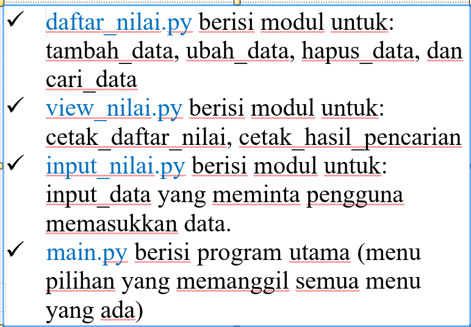
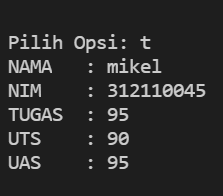
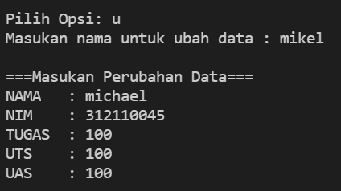
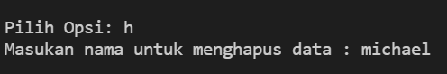
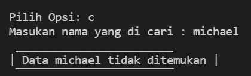
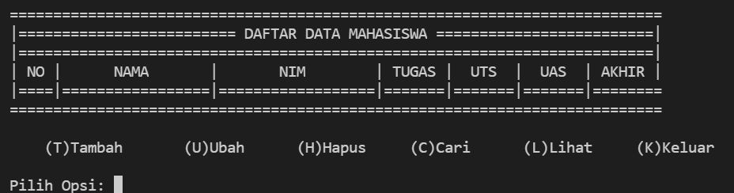
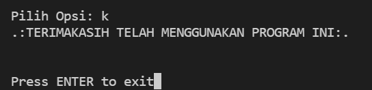

# UjianAkhirSemester
## PACKAGE & MODULE
NAMA : MICHAEL VALENTINO LAISINA

NIM : 312110045 

KELAS : TI.21.C1

Tugas :

menu tambah :

menu ubah :

nama mahasiswa diubah menjadi michael dan nilai nilai nya, yang tidak diubah hanya nim nya saja

menu hapus :

menghapus data mahasiswa atas nama michael

menu cari :

mahasiswa atas nama michael sudah tidak ada, karena sebelum nya dihapus

menu lihat :

dan dimenu lihat pun tidak ada, data mahasiswa atas nama michael karena sebelum nya dihapus

menu keluar program :

